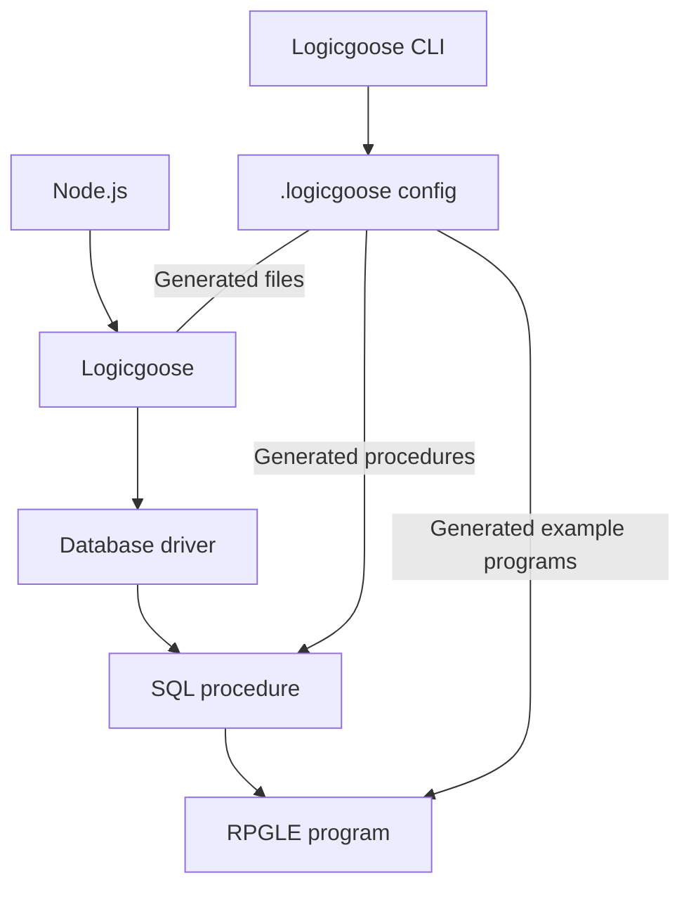

# logicgoose

End-to-end tool for calling RPGLE programs from Node.js with Mapepire or ODBC.

The user uses a simple JSON schema to define the input and output of the RPGLE program. The tool generates the TypeScript interfaces and the TS/Node.js code to call the RPGLE program. Logicgoose can also generates the RPGLE code to handle the input and output, as well as the SQL procedure code to call the program.

**What is the point of this?** Right now, Node.js doesn't have a simple way of calling RPGLE programs, other than itoolkit, which has a dependency of having something setup on the server (XMLSERVICE). While Logicgoose does require a procedure in the middle to call the program, all of the work to generate those procedures and code to call them is generated for you. This means that the RPGLE program can be called from any Node.js app without having to write the boilerplate code to call it.

### Installation

*Not yet published.*

Install from npm:

```bash
npm install logicgoose
```

Do not install globally with `-g`.

Add a script to your `package.json` to run the CLI:

```json
"scripts": {
  "logicgoose": "logicgoose"
}
```

### First time project setup

<details>

<summary>Click to expand</summary>

*This assumes an existing Node.js/TS app is being developed.*

Run the CLI to generate the configuration file:

```bash
npm run logicgoose -- --sample
```

This will create a `logicgoose.json` file in the root of your project. This file is used to define the programs that will be callable.

Now run Logicgoose again and it will generate new files in the `src` folder based on the configuration:

```bash
npm run logicgoose
```

By default, it will generate:

* RPGLE source code to show what the input and output parameters need to be based on the configuration.
* SQL procedure code to call the RPGLE program.

**Both the SQL procedure and RPGLE programs need to exist before they can be called**.

For the TypeScript project it generates two things:

* `SystemCalls` interface which is an object with all of the functions that are callable to the RPGLE programs.
* `setupLgCallers` function which builds the functions dynamically based on the connection.

To use the programs, you need to tell Logicgoose how to call the programs. This is where Mapepire or ODBC comes in. Create an instance of `LogicGoose` where the constructor has an `executor` callback after connecting to your database. The result must be the second parameter of the in/out parameters:

```ts
db.connect(DatabaseServer).then(() => {
  const lg = new LogicGoose({
    async executor(sql, parms) {
      const result = await db.query(sql, parms);
      if (result && result.output_parms && result.output_parms.length === 2) {
        const buffOut = result.output_parms[1].value;
        return buffOut
      }

      return undefined;
    }
  })

  setSystemCalls(setupLgCallers(lg));

  app.listen(port);
});
```

Here `setSystemCalls` is custom to this project. It is used to store the calling functions so they can be used elsewhere in the app.

</details>

### Some technical details

<details>
    <summary>See more</summary>

Logicgoose only supports the following RPGLE types to simply match up with some of JavaScript's primitives:

| RPGLE Type | JavaScript Type | Description |
|--|-|--|
| `char` | `string` | Fixed length string. Strings will be trimmed to fit the size |
| `zoned` | `number` |  |
| `ind` | `boolean` | Booleans are a single byte in RPGLE |



</details>

### To do:

* Maybe support COBOL
* Right now library/schema is hardcoded in the `logicgoose.json` file. It should be possible to delegate to a environment variable for the library.
* Look into `varchar` support
* Release on npm
