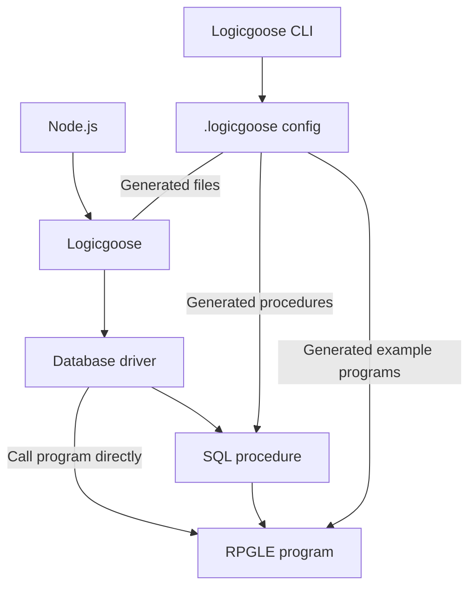

# logicgoose

End-to-end tool for calling RPGLE programs from Node.js with Mapepire or ODBC.

Logicgoose is two things:

1. A CLI tool to generate the boilerplate code to call RPGLE programs from Node.js.
2. A TypeScript library to call the generated code from the CLI.

The user defined a simple JSON schema to define the input and output of the RPGLE program. The tool generates the TypeScript interfaces and the TS/Node.js code to call the RPGLE program. Logicgoose can also generate the RPGLE code to handle the input and output, as well as the SQL procedure code to call the program if it is needed.

---

### What's the point?

Right now, Node.js doesn't have a simple way of calling RPGLE programs, other than itoolkit, which has a dependency of having something setup on the server (XMLSERVICE). While Logicgoose does sometimes require a procedure in the middle to call the program, all of the work to generate those procedures and code to call them is generated for you. This means that the RPGLE program can be called from any Node.js app without having to write the boilerplate code to call it. 

Secondly is type-safety when building applications that call those programs. Logicgoose ensures the input and output types are correct and we do this because we generate all the type defintions for you in the generated TypeScript code.

<details>
  <summary>Example</summary>

Here is the defintion of a program:

```json
    {
      "programName": "SIMPLE",
      "niceName": "simple",
      "bufferIn": [
        { "name": "name", "length": 10 },
        { "name": "coolness", "length": 10, "decimals": 0 }
      ],
      "bufferOut": [
        { "name": "name", "length": 10 },
        { "name": "coolness", "length": 10, "decimals": 0 },
        { "name": "result", "length": 10 }
      ]
    }
```

After you have run the Logicgoose CLI and generated all the types for it, then the language server ensure the types are correct when invoking the function:


Additionally, you can find the generated SQL procedure and RPGLE code in the `logicgoose` directory that is generated. The SQL procedure is used to call the program, and the RPGLE code is used to handle the input and output parameters.

</details>

---

### Installation

*Not yet published.*

Install from npm:

```bash
npm install logicgoose
```

Do not install globally with `-g`.

Add a script to your `package.json` to run the CLI:

```json
"scripts": {
  "logicgoose": "logicgoose"
}
```

---

### First time project setup

<details>

<summary>Click to expand</summary>

*This assumes an existing Node.js/TS app is being developed.*

Run the CLI to generate the configuration file:

```bash
npm run logicgoose -- --sample
```

This will create a `logicgoose.json` file in the root of your project. This file is used to define the programs that will be callable.

Now run Logicgoose again and it will generate new files in the `src` folder based on the configuration:

```bash
npm run logicgoose
```

By default, it will generate a folder that has:

* RPGLE source code to show what the input and output parameters need to be based on the configuration.
* SQL procedure code to call the RPGLE program.

**Both the SQL procedure and RPGLE programs need to exist before they can be called**.

For the TypeScript project it generates two things:

* `SystemCalls` interface which is an object with all of the functions that are callable to the RPGLE programs.
* `setupLgCallers` function which builds the functions dynamically based on the connection.

To use the programs, you need to tell Logicgoose how to call the programs. This is where Mapepire or ODBC comes in. Create an instance of `LogicGoose` where the constructor has an `executor` callback after connecting to your database. The result must be the second parameter of the in/out parameters.

Here is an example using Mapepire, Express, and Logicgoose:

```ts
declare global {
  namespace Express {
    interface Request {
      system: SystemCalls;
      db: Pool;
    }
  }
}

db.connect(DatabaseServer).then((pool) => {
  const lg = new LogicGoose({
    // In this case, user profile and library are the same
    schema: DatabaseServer.user.toUpperCase(),
    
    async executor(sql, parms, paramsOnly) {
      const result = await db.query(sql, parms);

      if (result) {
        if (paramsOnly) {
          return result.output_parms?.map(p => p.value);
        } else {
          return result.data;
        }
      }

      return undefined;
    }
  });

  const system = setupLgCallers(lg);

  app.use((req, res, next) => {
    req.system = system;
    req.db = pool;
    next();
  })

  app.listen(port, () => {
    console.log(`Example app listening on port ${port}`)
  });
});
```

Here `setSystemCalls` is custom to this project. It is used to store the calling functions so they can be used elsewhere in the app.

</details>

---

### Some technical details

<details>
    <summary>See more</summary>

Logicgoose only supports the following RPGLE types to simply match up with some of JavaScript's primitives:

| RPGLE Type | JavaScript Type | Description |
|--|-|--|
| `char` | `string` | Fixed length string. Strings will be trimmed to fit the size |
| `zoned` | `number` |  |
| `ind` | `boolean` | Booleans are a single byte in RPGLE |
| `data structure` | `object` | Multi-dimention arrays are supported! |



---

There are some instances where no SQL procedure is required to call the program directly. If you use the `rowOut` property for a program definition, then the program will be called directly, but only a result set can be return - which means only primitive types are supported and no sub-structs are allowed. If you require a more complicated structure, then you can use `bufferOut`, which will require a SQL procedure to be generated to call the program.

</details>

---

### To do:

* Maybe support COBOL
* Look into `varchar` support
* Test cases with vitest
* Use json schema for `.logicgoose` validation
* Release on npm
* Split up readme into wiki